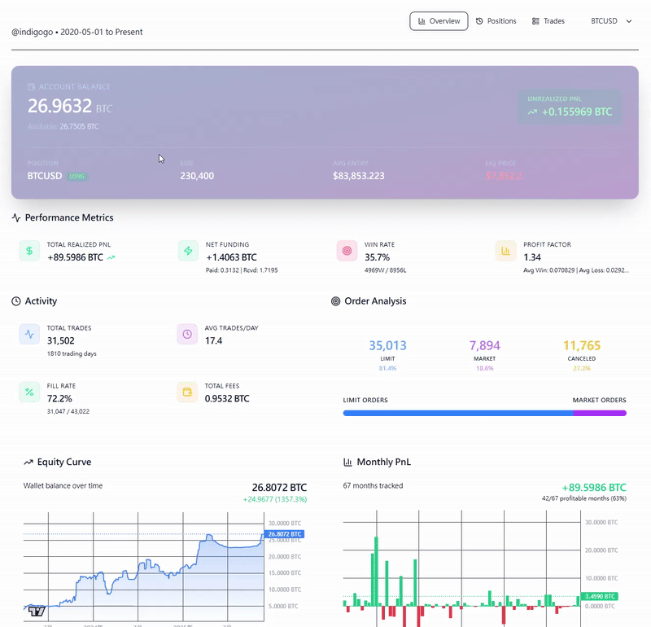

# 交易員 paulwei CEX 實盤紀錄平台


一個專門用於追蹤和分析 BitMEX 交易員實盤表現的數據分析平台。透過視覺化的圖表和詳細的統計數據，深入了解交易策略和倉位管理。

## ✨ 功能特色

- 📊 **多時間週期 K 線圖** - 支援 1m、5m、15m、30m、1h、4h、1d、1w 多種時間週期
- 📈 **倉位歷史分析** - 完整追蹤每一個倉位從開倉到平倉的過程
- 💰 **損益統計** - 月度 PnL、勝率、盈虧比等關鍵指標
- 📉 **權益曲線** - 視覺化資金變化趨勢
- 🎯 **交易標記** - 在 K 線圖上標記所有買賣點位
- 🔍 **倉位詳情** - 點擊倉位即可查看該倉位所有交易細節

## 📸 截圖預覽



## ⚠️ 重要說明：數據檔案

> **本專案不包含交易數據檔案！** 您需要另外下載數據並放置到指定位置才能運作。

### 必需的數據檔案

#### 1. 交易數據（根目錄）

以下檔案需要放置在專案根目錄：

```
PM_Platform/
├── bitmex_executions.csv      # 成交執行記錄（必需）
├── bitmex_trades.csv          # 交易記錄
├── bitmex_orders.csv          # 訂單歷史
├── bitmex_wallet_history.csv  # 錢包歷史（資金費率、存取款）
└── bitmex_account_summary.json # 帳戶摘要
```

#### 2. K 線數據（data/ohlcv 目錄）

以下檔案需要放置在 `data/ohlcv/` 目錄：

```
PM_Platform/
└── data/
    └── ohlcv/
        ├── XBTUSD_1m.csv      # BTC 1分鐘 K 線
        ├── XBTUSD_5m.csv      # BTC 5分鐘 K 線
        ├── XBTUSD_1h.csv      # BTC 1小時 K 線
        ├── XBTUSD_1d.csv      # BTC 日線
        ├── ETHUSD_1m.csv      # ETH 1分鐘 K 線
        ├── ETHUSD_5m.csv      # ETH 5分鐘 K 線
        ├── ETHUSD_1h.csv      # ETH 1小時 K 線
        └── ETHUSD_1d.csv      # ETH 日線
```

K 線數據 CSV 格式：
```csv
timestamp,open,high,low,close,volume,trades
2020-01-01T00:00:00.000Z,7218.5,7298.5,7115,7163,1097785557,352988
```

### 數據下載方式

數據檔案可從以下雲端連結下載：

📦 **交易數據** (CSV 檔案，放置於根目錄)
- 🔗 [下載連結](https://drive.google.com/file/d/11i_nJ90QpgP6Lnwalucapcsd2NbuC9co/view?usp=sharing)

📊 **K 線歷史數據** (OHLCV CSV 檔案，放置於 `data/ohlcv/` 目錄)
- 🔗 [下載連結](https://drive.google.com/file/d/1wB7SbNTXkfJA8zsu_ZN0MCRLxf4gBsGc/view?usp=sharing)

---

## 🚀 快速開始

### 環境需求

- Node.js 18+
- npm 或 yarn

### 安裝步驟

1. **Clone 專案**
```bash
git clone https://github.com/your-username/pm-platform.git
cd pm-platform
```

2. **安裝依賴**
```bash
npm install
```

3. **下載並放置數據檔案**

```bash
# 下載交易數據後解壓縮到根目錄
# 應該會有以下檔案：
# - bitmex_executions.csv
# - bitmex_trades.csv
# - bitmex_orders.csv
# - bitmex_wallet_history.csv
# - bitmex_account_summary.json

# 下載 K 線數據後解壓縮到 data/ohlcv/ 目錄
mkdir -p data/ohlcv
# 將 OHLCV CSV 檔案放入 data/ohlcv/
```

4. **啟動開發伺服器**
```bash
npm run dev
```

5. **開啟瀏覽器**

訪問 [http://localhost:3000](http://localhost:3000)

---

## 📜 數據抓取腳本

如果您有 BitMEX API 權限，可以使用以下腳本自行抓取數據：

### `scripts/export_all_data.js`

此腳本會從 BitMEX API 抓取以下數據：

- ✅ 成交執行記錄 (Executions)
- ✅ 交易記錄 (Trades)
- ✅ 訂單歷史 (Orders)
- ✅ 錢包歷史 (Wallet History)
- ✅ 帳戶摘要 (Account Summary)

**使用方式：**

1. 編輯 `scripts/export_all_data.js`，填入您的 API Key 和 Secret：
```javascript
const API_KEY = 'YOUR_API_KEY';
const API_SECRET = 'YOUR_API_SECRET';
```

2. 設定日期範圍：
```javascript
const START_DATE = new Date('2020-05-01');
const END_DATE = new Date('2025-11-24');
```

3. 執行腳本：
```bash
node scripts/export_all_data.js
```

> ⚠️ **注意：** API Key 需要有 Read-Only 權限。腳本會自動處理 API 速率限制。

### K 線數據

K 線數據需要另外使用 BitMEX 公開 API 或第三方數據源獲取。建議使用：

- BitMEX Trade Bucketed API: `GET /api/v1/trade/bucketed`
- CCXT 套件
- TradingView 數據導出

---

## 🛠️ 技術架構

| 技術 | 用途 |
|------|------|
| **Next.js 16** | React 全端框架 |
| **React 19** | UI 框架 |
| **TypeScript** | 類型安全 |
| **Tailwind CSS 4** | 樣式框架 |
| **Lightweight Charts** | K 線圖表 |
| **Recharts** | 統計圖表 |
| **CCXT** | 交易所 API |
| **Lucide React** | 圖標庫 |

---

## 📁 專案結構

```
PM_Platform/
├── app/                    # Next.js App Router
│   ├── api/               # API 路由
│   │   ├── ohlcv/        # K 線數據 API
│   │   └── trades/       # 交易數據 API
│   ├── page.tsx          # 主頁面
│   └── layout.tsx        # 根佈局
├── components/            # React 組件
│   ├── Dashboard.tsx     # 主儀表板
│   ├── TVChart.tsx       # K 線圖表
│   ├── PositionSessionList.tsx  # 倉位列表
│   ├── PositionDetail.tsx       # 倉位詳情
│   ├── StatsOverview.tsx        # 統計概覽
│   ├── MonthlyPnLChart.tsx      # 月度 PnL
│   └── EquityCurve.tsx          # 權益曲線
├── lib/                   # 工具庫
│   ├── types.ts          # TypeScript 類型定義
│   └── data_loader.ts    # 數據載入器
├── data/                  # K 線數據目錄
│   └── ohlcv/            # OHLCV CSV 檔案
├── scripts/               # 數據抓取腳本
│   └── export_all_data.js
└── *.csv / *.json        # 交易數據檔案
```

---

## 📊 數據說明

### Executions (成交執行記錄)

| 欄位 | 說明 |
|------|------|
| execID | 執行 ID |
| orderID | 訂單 ID |
| symbol | 交易對 (XBTUSD, ETHUSD) |
| side | 方向 (Buy/Sell) |
| lastQty | 成交數量 |
| lastPx | 成交價格 |
| execType | 執行類型 (Trade/Funding/Settlement) |
| execCost | 執行成本 (satoshis) |
| execComm | 手續費 (satoshis) |
| timestamp | 時間戳 |

### Position Session (倉位週期)

平台會自動將交易記錄整理成「倉位週期」，每個週期代表從開倉到平倉的完整過程：

- **Long 多倉**：淨部位從 0 → 正數 → 0
- **Short 空倉**：淨部位從 0 → 負數 → 0

---

## 🔧 開發指令

```bash
# 開發模式
npm run dev

# 建置生產版本
npm run build

# 啟動生產伺服器
npm run start

# 程式碼檢查
npm run lint
```

---

## 📝 License

MIT License

---

## 🙏 致謝

感謝交易員 **paulwei** 提供 Read-Only API 權限，讓這個學習平台得以實現。

本平台記錄了 paulwei 從 2020 年 5 月至今在 BitMEX 的實盤交易紀錄，供有興趣研究交易策略的人學習參考。

---

**⚠️ 免責聲明：本平台僅供學習和研究使用，不構成任何投資建議。加密貨幣交易具有高風險，請謹慎投資。**

